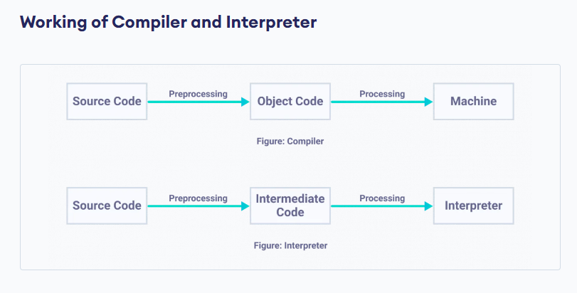

# Module 2



## Syntax, Semantics, Lexing

In Python, the **syntax** of a program is the set of rules that defines how the program will be written and interpreted by both the runtime system and human readers. The **semantics** of a program, on the other hand, involve the meaning of the statements and how they interact with each other.

**Lexing**, also known as tokenization, is the process of breaking down a program into a sequence of tokens, which are the basic building blocks of the language. The Python interpreter uses a lexer to convert the source code into a sequence of tokens that can be parsed by the parser .Parsing is the process of analyzing the sequence of tokens to determine the structure of the program and how the tokens relate to each other. The Python interpreter uses a parser to build an abstract syntax tree (AST) from the sequence of tokens. The AST represents the structure of the program and can be used to execute the program .Here's an example of how the Python interpreter lexes and parses a simple program:
```python
x = 1 + 2
print(x)
```
The lexer would break down this program into the following sequence of tokens:
```python
NAME 'x'
EQUALS '='
NUMBER '1'
PLUS '+'
NUMBER '2'
NEWLINE '\n'
NAME 'print'
LPAREN '('
NAME 'x'
RPAREN ')'
NEWLINE '\n'
```
The parser would then use these tokens to build an AST that represents the structure of the program:
```
Module(body=[
  Assign(targets=[Name(id='x', ctx=Store())],
         value=BinOp(left=Num(n=1), op=Add(), right=Num(n=2))),
  Expr(value=Call(func=Name(id='print', ctx=Load()),
                   args=[Name(id='x', ctx=Load())],
                   keywords=[]))
])
```
The AST can then be used to execute the program by interpreting each node in the tree.

## Keywords
Python keywords are special reserved words that have specific meanings and purposes and cannot be used for anything but those specific purposes. These keywords are always available and do not need to be imported into the code.

## Intro to REPL:
Repl.it is an online development environment that allows you to write, run, and share code in various programming languages, including Python. Repl.it provides a Python REPL (Read-Eval-Print Loop) that allows you to enter Python code and see the results immediately. The Python REPL is available in every Python installation.
```python
>>> person={}
>>> person['fname']='Joe' 
>>> person['lname']='Fronebone'
>>> person['age']=51
>>> person['spouse']='alica'
>>> person['children']=['Ram','Sita','Hari']
>>> person['pets']={'dog':'sunflowerU','cat':'Tommy'}
>>> person
{'fname': 'Joe', 'lname': 'Fronebone', 'age': 51, 'spouse': 'alica', 'children': ['Ram', 'Sita', 'Hari'], 'pets': {'dog': 'sunflowerU', 'cat': 'Tommy'}}
>>> person['fname']
'Joe'
>>> person['age']
51
>>> person['children']
['Ram', 'Sita', 'Hari']
>>> person['children'][-1]
'Hari'
>>> person['pets']['dog']
'sunflowerU'
>>>
```

## Virtual Environment
A virtual environment is a self-contained Python environment that allows you to install and manage packages separately from the system Python installation and other virtual environments. This is useful when working on multiple projects with different dependencies or when you want to isolate your project from the system Python installation.

To create and manage virtual environments in Python on Windows command prompt, you can use the built-in “venv”

module. Here are the steps to create and activate a virtual environment in Python on Windows command prompt:

1. Open the command prompt and navigate to the directory where you want to create the virtual environment.
2. Create a new virtual environment using the following command: This will create a new virtual environment named **`myenv`** in the current directory.
    
    ```python -m venv myenv```
    
3. Activate the virtual environment using the following command: This will activate the virtual environment and change the command prompt to show the name of the virtual environment in parentheses.
    
    ```myenv\Scripts\activate.bat```
    
4. You can now install packages and run Python scripts in the virtual environment. When you're done, you can deactivate the virtual environment using the following command: This will deactivate the virtual environment and return the command prompt to its original state.
    
    ```deactivate```